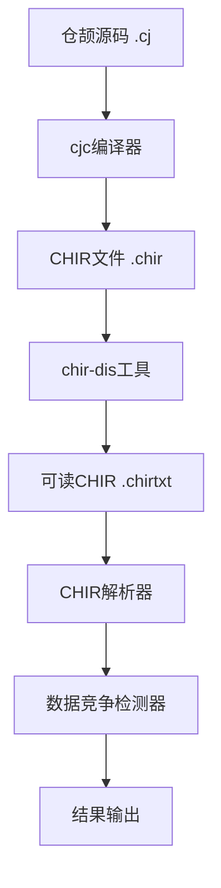

# 仓颉数据竞争静态检测工具 - 优化计划

## 当前状态分析

### 已完成的工作
1. **基础源码解析器** - 基于正则表达式解析仓颉源码
2. **并发分析模块** - 识别spawn线程、变量访问
3. **数据竞争检测** - 检测RW和WW类型竞争
4. **输出格式化** - 符合比赛要求的输出格式
5. **测试用例** - 5个测试用例全部通过

### 当前实现的局限性
1. **基于正则表达式** - 无法处理复杂语法结构
2. **缺乏数据流分析** - 无法追踪变量传播
3. **同步原语支持有限** - 仅支持Mutex
4. **可能存在误报/漏报** - 需要更精确的分析

---

## 优化方案

### 方案一：集成CHIR中间表示（推荐）

#### 优势
- CHIR是编译器生成的精确中间表示
- 包含完整的控制流和数据流信息
- 可以利用编译器的前端分析结果

#### 实现步骤



#### 步骤1：构建仓颉SDK
```bash
# 环境准备
export WORKSPACE=/path/to/workspace
mkdir -p $WORKSPACE && cd $WORKSPACE

# 拉取源码（已完成）
# cangjie_compiler, cangjie_runtime, cangjie_tools, cangjie_stdx

# 构建编译器
cd $WORKSPACE/cangjie_compiler
python3 build.py build -t release --no-tests --build-cjdb
python3 build.py install

# 验证
source output/envsetup.sh
cjc -v
```

#### 步骤2：生成CHIR
```bash
# 编译仓颉项目并输出CHIR
cjc --emit-chir -o output.chir source.cj

# 使用chir-dis反序列化
chir-dis output.chir  # 生成 output.chirtxt
```

#### 步骤3：实现CHIR解析器
创建 `src/chir_parser/chir_parser.py`:
- 解析 `.chirtxt` 文本格式
- 提取Spawn表达式
- 构建控制流图
- 分析变量访问

### 方案二：增强源码解析器（备选）

如果无法构建SDK，可以增强现有源码解析器：

1. **使用tree-sitter** - 构建仓颉语法树解析器
2. **实现简化数据流分析** - 追踪变量赋值和传播
3. **增强同步原语识别** - 支持更多同步机制

---

## 详细任务清单

### 阶段1：CHIR集成（优先级：高）

#### 1.1 构建环境准备
- [ ] 检查LLVM版本（需要LLVM 15+）
- [ ] 安装构建依赖（cmake, ninja, python3）
- [ ] 配置环境变量

#### 1.2 构建仓颉SDK
- [ ] 构建cangjie_compiler
- [ ] 构建cangjie_runtime
- [ ] 构建cangjie_stdlib
- [ ] 验证cjc和chir-dis工具

#### 1.3 CHIR解析器实现
- [ ] 分析CHIR文本格式结构
- [ ] 实现CHIR文本解析器
- [ ] 提取Spawn表达式和闭包
- [ ] 构建控制流图
- [ ] 提取变量访问信息

### 阶段2：增强分析能力（优先级：中）

#### 2.1 数据流分析
- [ ] 实现定义-使用链
- [ ] 追踪变量传播
- [ ] 分析函数调用影响

#### 2.2 同步原语支持
- [ ] RWLock读写锁支持
- [ ] SpinLock自旋锁支持
- [ ] Atomic原子操作支持
- [ ] Channel通道支持

#### 2.3 精度优化
- [ ] 减少误报：更精确的同步区域检测
- [ ] 减少漏报：跨函数调用分析
- [ ] 处理复杂场景：嵌套spawn、条件竞争

### 阶段3：测试与文档（优先级：高）

#### 3.1 测试用例
- [ ] 添加更多基础测试用例
- [ ] 添加复杂场景测试用例
- [ ] 添加边界情况测试

#### 3.2 文档更新
- [ ] 更新设计文档
- [ ] 更新README
- [ ] 添加使用说明

#### 3.3 代码提交
- [ ] 整理代码结构
- [ ] 推送到GitHub

---

## 技术细节

### CHIR格式分析

基于 `cangjie_compiler` 源码分析，CHIR包含：

1. **Spawn表达式** (`ExprKind::SPAWN`)
   - `GetFuture()` - 获取Future对象
   - `GetSpawnArg()` - 获取spawn参数
   - `GetClosure()` - 获取闭包函数

2. **内存访问表达式**
   - `Load` - 读操作
   - `Store` - 写操作
   - `GetElementRef` - 数组/结构体访问

3. **控制流**
   - `Block` - 基本块
   - `BlockGroup` - 基本块组（函数体）
   - `Terminator` - 终结指令（分支、跳转）

### 检测算法改进

```
1. 解析CHIR获取：
   - 所有Spawn表达式（线程创建点）
   - 每个Spawn的闭包函数
   - 闭包内的所有内存访问

2. 构建线程访问集合：
   - 对每个Spawn，收集其闭包内的所有访问
   - 标记访问类型（读/写）
   - 记录访问位置

3. 同步区域分析：
   - 识别Lock/Unlock配对
   - 标记受保护的访问
   - 排除同步保护的竞争

4. 竞争检测：
   - 比较不同线程的访问集合
   - 检测同一变量的冲突访问
   - 输出竞争报告
```

---

## 风险与应对

### 风险1：SDK构建失败
- **原因**：LLVM版本不兼容、依赖缺失
- **应对**：使用备选方案（增强源码解析器）

### 风险2：CHIR格式复杂
- **原因**：文档不完整，格式变化
- **应对**：分析chir-dis输出，逆向工程

### 风险3：分析精度不足
- **原因**：复杂场景难以精确分析
- **应对**：保守策略，宁可误报不漏报

---

## 时间规划

| 阶段 | 任务 | 状态 |
|------|------|------|
| 阶段1 | CHIR集成 | 进行中 |
| 阶段2 | 增强分析 | 待开始 |
| 阶段3 | 测试文档 | 待开始 |

---

## 下一步行动

1. **立即执行**：尝试构建仓颉SDK
2. **并行准备**：分析CHIR文本格式样本
3. **备选方案**：准备增强源码解析器的实现